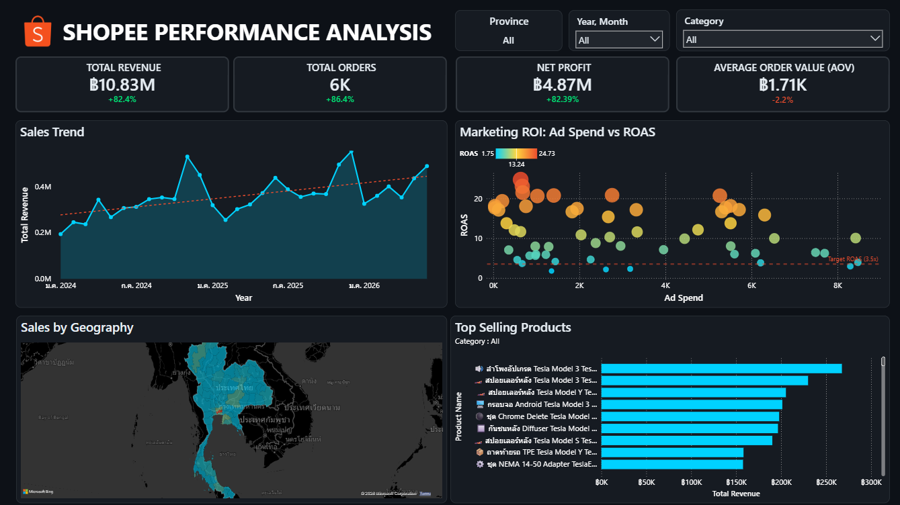

# 🛒 Shopee E-Commerce Sales & Ads Performance Analytics
**End-to-End Data Pipeline & Interactive Power BI Dashboard**



## 📌 Project Overview
This project showcases an end-to-end data analytics pipeline designed to evaluate the sales performance and advertising efficiency (ROAS) of a Shopee storefront. The solution spans from data extraction and cloud database provisioning to advanced data modeling and interactive visualization.

**Goal:** Provide actionable insights to optimize ad spend, identify top-performing products, and analyze geographical sales distribution.

---

## 📊 Dataset Context & Business Scenario
> **⚠️ Privacy & Confidentiality Note:** 
> To uphold strict data privacy standards and professional ethics (PDPA compliance), the `.csv` datasets provided in this repository are **AI-generated synthetic datasets**. They do not contain any real customer or corporate data. 

The simulated business scenario represents a **Thai E-Commerce Retailer on Shopee**. The dataset covers:
- **Transactional Data:** Over 10,000+ simulated order records spanning across 77 provinces in Thailand.
- **Advertising Data:** Simulated Shopee Discovery Ads performance (Impressions, Clicks, Spend, Revenue) across various product campaigns.
- **Product Dimension:** Various product categories, price points, and SKUs.

---

## 🛠️ Technology Stack
- **Cloud Database:** Neon (Serverless PostgreSQL)
- **Database Management:** pgAdmin 4
- **ETL Process:** Python (Pandas)
- **Data Visualization:** Power BI
- **Languages:** SQL, Python, DAX

---

## 🏗️ Data Architecture & Pipeline

### 1. Database Provisioning (Neon & pgAdmin)
- Provisioned a cloud-based PostgreSQL database using **Neon**.
- Utilized **pgAdmin 4** to execute DDL scripts, establishing a robust relational schema with designated Primary Keys (PK) and Foreign Keys (FK).

### 2. Automated ETL Process (AI-Assisted)
- Designed the data transformation logic and utilized AI-assisted Python scripting (`shopee_etl.py`) to automate the extraction of raw data exported from the Shopee Seller Center.
- **Data Cleansing:** 
  - Standardized Thai province names (e.g., removing prefixes like "จังหวัด") to ensure accurate geographical mapping.
  - Aggregated lifetime ad metrics and merged them with transactional order data.
- **Export:** Transformed data was loaded into a structured format (`fact_order.csv`, `fact_ad.csv`, `dim_product.csv`) for the visualization layer.

### 3. Data Modeling (Star Schema)
Designed a highly optimized **Star Schema** to ensure peak performance and seamless cross-filtering:
- **Fact Tables:** `fact_order` (Sales) and `fact_ad` (Advertising)
- **Dimension Tables:** `dim_product` and a centralized `Calendar` table
- **Cross-Filtering:** By linking both fact tables to the shared `Calendar` (`order_date` & `campaign_month`) and `dim_product`, the dashboard can effortlessly evaluate organic sales vs. ad performance side-by-side within the exact same time context.

### 4. Advanced DAX & Business Logic
To elevate the user experience and ensure accurate reporting, several advanced DAX techniques were implemented:

#### 🟢 Smart Time Intelligence (`ISINSCOPE`)
Engineered a dynamic measure that intelligently detects the slicer's context to switch between **MoM (Month-over-Month)** and **YoY (Year-over-Year)** growth automatically using `ISINSCOPE`.
```dax
% Smart Change Total Revenue = 
VAR MoM_Change = DIVIDE([Total Revenue] - [Prev Month Revenue], [Prev Month Revenue])
VAR YoY_Change = DIVIDE([Total Revenue] - [Prev Year Revenue], [Prev Year Revenue])
RETURN
SWITCH(
    TRUE(),
    ISINSCOPE('Calendar'[Month Name]) || HASONEVALUE('Calendar'[Month Name]), MoM_Change,
    YoY_Change
)
```

#### 🟢 Real-time Data Cleansing (Calculated Columns)
Solved Bing Maps' geocoding limitations for complex Thai provinces (e.g., *Bueng Kan*, *Phra Nakhon Si Ayutthaya*) by using DAX string manipulation directly in Power BI.
```dax
Province_Map = 
VAR CleanName = TRIM(SUBSTITUTE('fact_order'[province], "จังหวัด", ""))
RETURN
SWITCH(
    CleanName, 
    "บึงกาฬ", "Bueng Kan, Thailand",
    "อยุธยา", "Phra Nakhon Si Ayutthaya, Thailand",
    "พระนครศรีอยุธยา", "Phra Nakhon Si Ayutthaya, Thailand",
    CleanName
)
```

#### 🟢 Core Advertising KPIs
Developed essential business metrics to track campaign profitability:
- **ROAS (Return on Ad Spend):** `DIVIDE(SUM('fact_ad'[ad_revenue]), [Total Ad Spend], 0)`
- **CTR (Click-Through Rate):** `DIVIDE(SUM('fact_ad'[clicks]), SUM('fact_ad'[impressions]), 0)`
- **CPA (Cost Per Acquisition):** `DIVIDE([Total Ad Spend], SUM('fact_ad'[orders]), 0)`

---

## 💡 Business Insights & Dashboards
The final Power BI dashboard utilizes a premium dark-mode aesthetic to reduce eye strain and highlight key metrics:
- **Geographical Heatmap:** Visualizes revenue distribution across Thailand's 77 provinces.
- **ROAS Analysis:** Tracks the Return on Ad Spend for different product categories to identify which campaigns are bleeding money vs. driving profit.
- **Interactive KPIs:** Provides instant insights into Total Revenue, Total Orders, and Net Profit with dynamic growth percentages.

---

## 📁 Repository Structure
- `/03-powerbi-sql-shopee-dashboard/`
  - `fact_order.csv` - Transactional Fact Table
  - `fact_ad.csv` - Advertising Fact Table
  - `dim_product.csv` - Product Dimension Table

> **🚀 Live Interactive Dashboard:** 
> You can interact with the live dashboard directly here: **[View Shopee PowerBI Dashboard](https://app.powerbi.com/view?r=eyJrIjoiNjFhMjI0ZjgtYzkzMi00MDFlLWJhMDYtNWFjZDMwMjM0MTQyIiwidCI6IjQ0ZTE2M2UzLTQxYzctNDg1Ny05YWJlLWNlMzdiNDdlNTExNiIsImMiOjEwfQ%3D%3D)**
