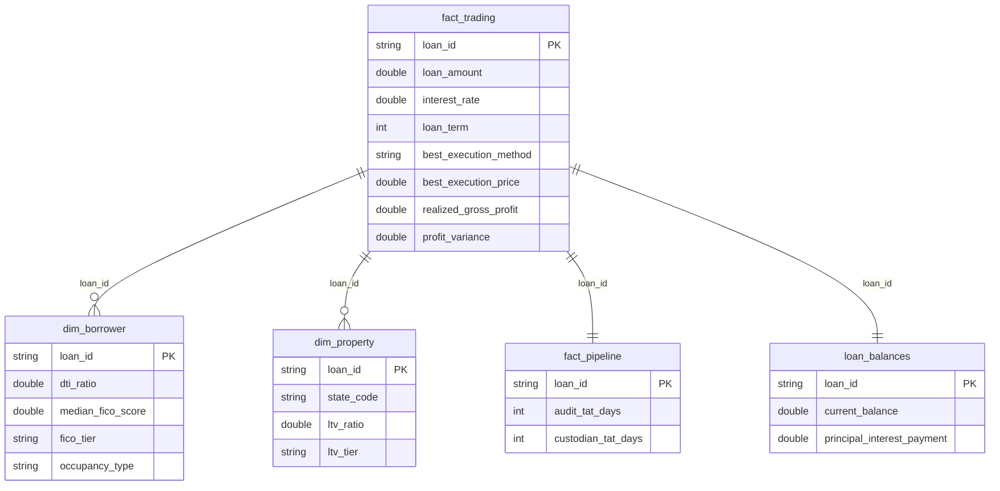

# 📊 Mortgage Capital Markets Dashboard

An advanced Power BI dashboard analyzing mortgage loan portfolios from a **Secondary Market (Capital Markets)** perspective. Covers Best Execution pricing, Risk & Underwriting metrics, Pipeline operational efficiency, and 30-year Loan Amortization projections.

**🔗 [View Live Dashboard](https://app.powerbi.com/view?r=eyJrIjoiY2U5Y2Q4OGMtODBlMy00ZTk3LWJhNDItNWQzODA5ZDZjYTZjIiwidCI6IjQ0ZTE2M2UzLTQxYzctNDg1Ny05YWJlLWNlMzdiNDdlNTExNiIsImMiOjEwfQ%3D%3D)**

---

## 📸 Dashboard Preview

### Page 1: Executive Summary & Profitability


### Page 2: Risk & Underwriting Analysis


### Page 3: Pipeline & Operational Efficiency


### Page 4: Loan Amortization & Cash Flow


---

## 🛠️ Tech Stack

| Layer | Technology |
|---|---|
| **ETL / Data Transformation** | SQL (DuckDB), Python |
| **Data Visualization** | Power BI Desktop |
| **Data Modeling** | Star Schema (Fact & Dimension Tables) |

---

## 🏗️ Data Architecture (Star Schema)



---

## 📈 Key Features by Page

### Page 1: Executive Summary & Profitability
- **Best Execution Engine:** Compares Securitization (UMBS) vs Whole Loan Sale pricing to find the highest return for each loan
- **Waterfall Chart:** Revenue breakdown using a Disconnected Table technique (Trade Premium → Origination Charges → Lender Credits → Net Profit)
- **Profit Variance Tracking:** Actual Realized Profit vs Target Profit over time

### Page 2: Risk & Underwriting Analysis
- **DTI & LTV Histograms:** Distribution analysis with regulatory threshold lines (QM 43% DTI, PMI 80% LTV)
- **FICO Tier Breakdown:** 100% Stacked chart showing credit quality composition by loan purpose
- **Risk Heatmap Matrix:** State-level risk concentration with conditional formatting

### Page 3: Pipeline & Operational Efficiency
- **Turnaround Time (TAT) Analysis:** Audit and Custodian processing speed by loan purpose
- **Gauge Chart:** Real-time SLA monitoring (Audit TAT vs 5-day target)
- **Monthly Trend:** Capacity planning insights for identifying seasonal bottlenecks

### Page 4: Loan Amortization & Cash Flow
- **30-Year Projection:** Amortization schedule using `PV()`, `PMT()`, `PPMT()`, `IPMT()` DAX functions
- **O(1) Performance Optimization:** Replaced nested SUMX loops with closed-form financial functions for instant rendering
- **Balance Burn-Down Curve:** Area chart showing portfolio principal reduction over 360 months

---

## 🔧 ETL Pipeline

The raw Excel datasets are transformed into a clean Star Schema using **DuckDB SQL**:

```
Raw Excel Files (6 tables)
    │
    ▼  [convert_excel_to_csv.py]
Raw CSV Files (raw_data/)
    │
    ▼  [sql/mortgage_etl.sql via DuckDB]
Star Schema CSV Files (processed_data/)
    │
    ▼  [Power BI Import]
Dashboard
```

**Key Transformations:**
- **Best Execution Pricing:** `GREATEST()` across 5 investor bids vs UMBS price
- **DTI Calculation:** `(Monthly Debt + P&I Payment) / (Annual Income / 12) × 100`
- **LTV Calculation:** `(Loan Amount / Property Value) × 100` with risk tier classification
- **TAT Computation:** `DATE_DIFF('day', start_date, end_date)` for Audit and Custodian stages

---

## 📂 Project Structure

```
04-powerbi-mortgage-capital-markets-dashboard/
├── README.md                          # This file
├── screenshots/                       # Dashboard page screenshots
│   ├── page1_executive_summary.png
│   ├── page2_risk_underwriting.png
│   ├── page3_pipeline_efficiency.png
│   └── page4_loan_amortization.png
├── raw_data/                          # Original CSV data (6 tables)
│   ├── loan_data.csv
│   ├── loan_bids.csv
│   ├── loan_balances.csv
│   ├── loan_status.csv
│   ├── target_profit.csv
│   ├── umbs_prices.csv
│   └── raw_data_dictionary.md
├── sql/
│   └── mortgage_etl.sql              # DuckDB ETL pipeline
├── processed_data/                    # Star Schema output (4 tables)
│   ├── fact_trading.csv
│   ├── dim_borrower.csv
│   ├── dim_property.csv
│   └── fact_pipeline.csv
├── convert_excel_to_csv.py            # Raw data converter
├── run_etl.py                         # ETL runner script
└── Mortgage_Trading_Premium_Theme.json # Power BI custom theme
```

---

*Created by Sirawit Techachaikulsiri*
