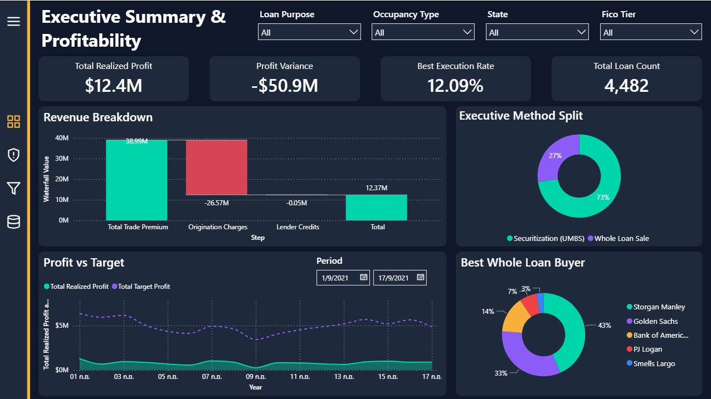
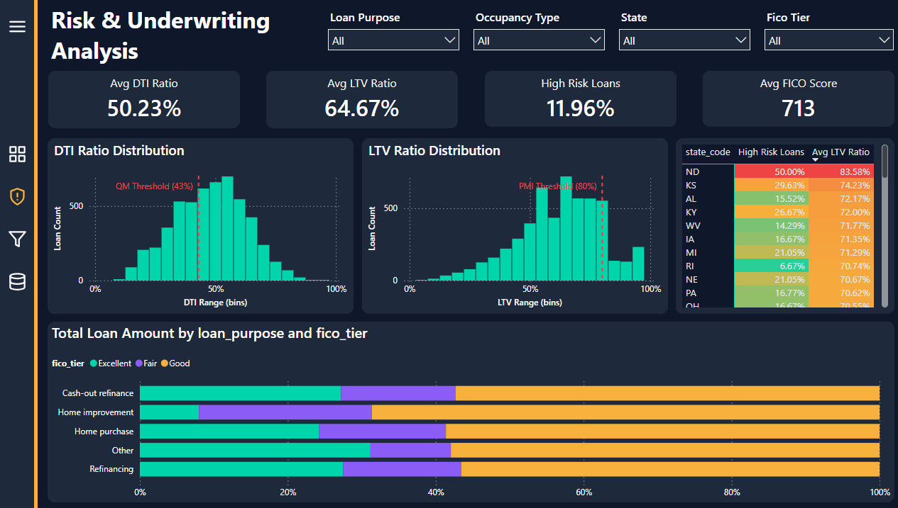
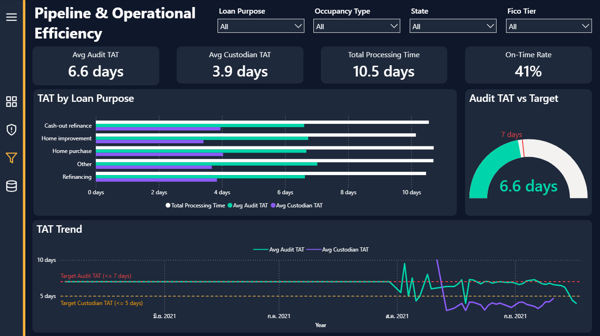
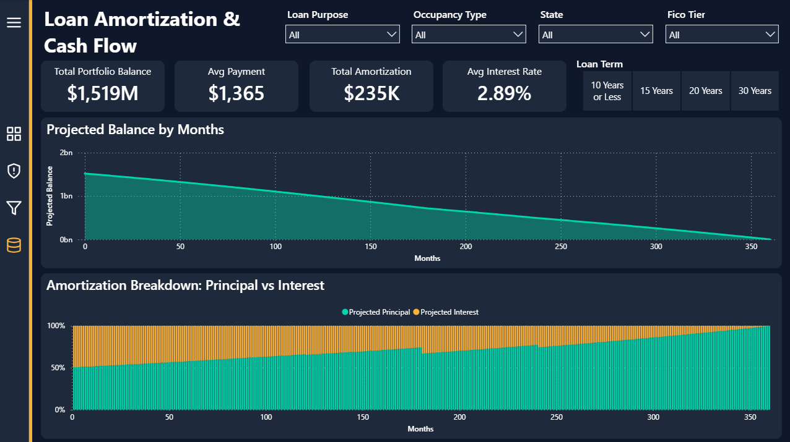
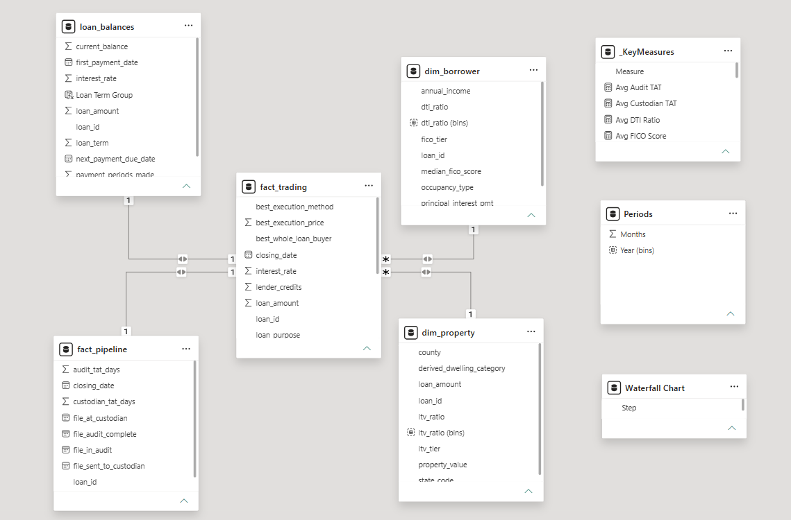

# 📊 Mortgage Capital Markets Analytics
**End-to-End Data Pipeline & Interactive Power BI Dashboard**

> **🚀 Live Interactive Dashboard:** 
> You can interact with the live dashboard directly here: **[View Mortgage Capital Markets Dashboard](https://app.powerbi.com/view?r=eyJrIjoiY2U5Y2Q4OGMtODBlMy00ZTk3LWJhNDItNWQzODA5ZDZjYTZjIiwidCI6IjQ0ZTE2M2UzLTQxYzctNDg1Ny05YWJlLWNlMzdiNDdlNTExNiIsImMiOjEwfQ%3D%3D)**

## 📌 Project Overview
This project showcases an advanced Power BI analytical solution designed to evaluate mortgage loan portfolios from a **Secondary Market (Capital Markets)** perspective. The pipeline spans from raw data transformation via SQL (DuckDB) to complex Star Schema modeling and high-performance financial computations in Power BI.

**Goal:** Provide actionable insights to optimize Best Execution pricing, evaluate underwriting risks, monitor operational pipeline efficiency, and project 30-year loan amortization cash flows.

---

## 📊 Dataset Context & Business Scenario
> **⚠️ Privacy & Confidentiality Note:** 
> The `.csv` datasets provided in this repository are **synthetic datasets sourced from DataCamp**. They do not contain any real borrower or corporate financial data.

The simulated business scenario represents a **US-Based Mortgage Lender**. The dataset covers:
- **Transactional Data:** Simulated loan originations, pricing bids from various investors (e.g., Storgan Manley, Golden Sachs), and UMBS securitization prices.
- **Risk Profiles:** Borrower DTI (Debt-to-Income), LTV (Loan-to-Value), and FICO credit scores.
- **Operational Data:** Processing times (Audit & Custodian Turnaround Time) for operational capacity tracking.

---

## 💡 Business Questions & Analytical Solutions

A data dashboard is only as valuable as the business problems it solves. This project was designed to answer critical questions across four key domains:

### 1. Profitability & Trading Optimization (Executive Summary)

**Business Question:** *How do we maximize profit margins for each loan we originate?*
**Solution:** The dashboard features a **Best Execution Engine** that dynamically compares 5 different investor Whole Loan bids against the current UMBS (Securitization) price. By automatically identifying the most profitable exit strategy, the business can capture maximum revenue. The accompanying Waterfall chart traces the exact margin components from Trade Premium down to Net Profit.

### 2. Risk & Underwriting (Page 2)

**Business Question:** *Are we originating loans within safe regulatory boundaries, and where are our highest risk concentrations?*
**Solution:** The **Risk Heatmap** and distribution histograms allow risk officers to instantly spot loans exceeding Qualified Mortgage (43% DTI) limits or requiring PMI (80% LTV). The 100% Stacked FICO Tier chart continuously monitors the credit quality of the portfolio, preventing the accumulation of high-risk subprime debt (NPL).

### 3. Operational Efficiency & SLAs (Page 3)

**Business Question:** *Where are the bottlenecks in our loan processing, and are we meeting our Service Level Agreements (SLAs)?*
**Solution:** The **Turnaround Time (TAT) metrics** and real-time SLA gauges track the speed of Audit and Custodian processing. If the Audit TAT exceeds the 5-day target, management can instantly identify the backlog by loan purpose and reallocate staff to prevent funding delays.

### 4. Cash Flow Forecasting (Page 4)

**Business Question:** *What does our portfolio's principal paydown and cash flow trajectory look like over the next 30 years?*
**Solution:** The 360-month **Amortization Curve** projects future balances and principal reduction. By utilizing mathematically optimized financial DAX functions, stakeholders can instantly forecast long-term cash flow scenarios across the entire portfolio.

---

## 🧠 Data Architecture & Advanced DAX

### 1. Data Modeling & Architecture

#### 🟢 Architecture Optimization & Trade-offs
In the current implementation, the data model utilizes a **1-to-1 Relationship** (linked by `loan_id`) across multiple fact and dimension tables. 
- **Why it was built this way:** This modular approach allows for rapid prototyping and compartmentalized logic during the initial development phase, making it easier to audit individual business domains (e.g., Risk vs. Trading).
- **Enterprise Scalability (Kimball Methodology):** To scale this for an enterprise-level data warehouse, this model should be optimized into a true **Star Schema**. By consolidating static borrower/property attributes into a central `dim_loan` (Degenerate Dimension) and numeric metrics into a unified `fact_loan_metrics` table, we can eliminate cross-filtering overhead in Power BI, drastically improving DAX query performance over millions of rows.

### 2. Advanced DAX & Financial Logic
To ensure instant rendering and accurate financial forecasting, several advanced DAX techniques were implemented:

- **O(1) Amortization Performance:** Replaced resource-heavy nested `SUMX` iterative loops with highly optimized, closed-form financial DAX functions (`PV()`, `PMT()`, `PPMT()`, `IPMT()`). This architectural decision reduced calculation time from exponential `O(N^2)` to constant time `O(1)`, allowing instant 360-month amortization projections.
- **Waterfall Profit Breakdown:** Implemented a disconnected dimension table to construct a dynamic Waterfall chart, allowing users to trace revenue flow step-by-step.

### 3. Automated ETL Process (DuckDB)
- Utilized an **AI-generated Python script** (`run_etl.py`) executing **DuckDB SQL** to transform raw `.csv` extracts into an analytical model.
- **Data Cleansing:** Computed Best Execution Pricing dynamically using `GREATEST()` and `CASE` logic. Calculated regulatory metrics (DTI and LTV ratios) and categorized them into risk tiers.

---

## 🛠️ Technology Stack
- **Database & ETL Engine:** DuckDB (In-Process SQL OLAP)
- **ETL Process:** Python & SQL
- **Data Visualization:** Power BI Desktop
- **Data Modeling:** Star Schema (Fact & Dimension Tables)
- **Languages:** SQL, Python, DAX

---

## 📁 Repository Structure

- `/04-powerbi-mortgage-capital-markets-dashboard/`
  - `README.md` - Project Documentation
  - `Mortgage_Trading_Premium_Theme.json` - Power BI Custom Theme
  - `convert_excel_to_csv.py` - Raw Data Converter Script
  - `run_etl.py` - ETL Runner Script
  - `/assets/` - Dashboard page screenshots and Data Model
  - `/raw_data/` - Original CSV datasets (6 tables)
  - `/sql/` - DuckDB ETL pipeline scripts
  - `/processed_data/` - Cleansed Star Schema output for Power BI (4 tables)
